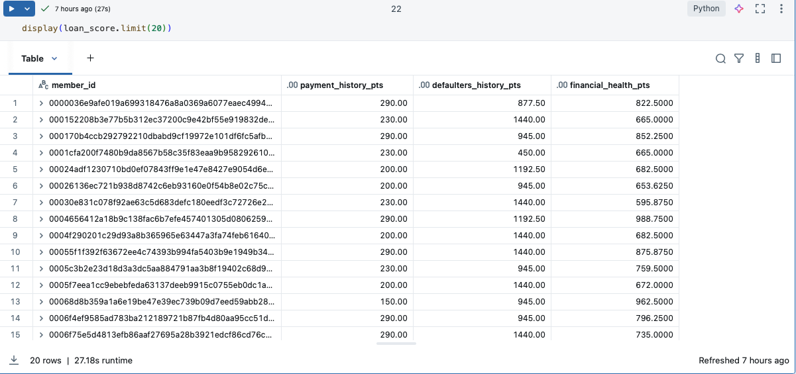

# Lending Club Risk Analytics on Databricks

This project processes the Lending Club dataset end-to-end on **Azure & Azure Databricks**, from raw ingestion to a consolidated **One Big Table (OBT)** and a final **Loan Score**.  
Below are **tools & the exact steps** performed, organized by notebook execution order, including Azure setup and the Databricks objects used.

Data File Download: [Link](https://drive.google.com/file/d/1xoy8Y0TFiKCz9S_NKWg4EYJnoHh2pbnN/view?usp=sharing) 

---
## Tools & Features
### Azure (Services, Roles, Identity)
- Azure Data Lake Storage Gen2 (ADLS)
  - Container: `lendingclub` (raw/processed/cleaned/cleaned_final paths).
- Azure Key Vault (AKV)
  - Stored credentials (storage account name/key or SAS).
  - Granted Databricks workspace identity get/list permissions for secrets access.
- Azure Databricks Access Connector (Managed Identity)
  - Used for credential-less access to ADLS from Unity Catalog.
  - Assigned Storage Blob Data Contributor role on the ADLS account/container.
- Azure RBAC
  -Key roles used: `Storage Blob Data Contributor` (ADLS), `Key Vault Secrets User/Reader` (AKV) as applicable.
- Azure Portal
  - Provisioning of AKV, ADLS, Access Connector, and RBAC assignments.
### Databricks (Spark Transformations, Security, Governance, Storage Abstraction)
- Secret Scope (AKV-backed)
  - Scope: `databricksazurestorage`.
  - Accessed with `dbutils.secrets.get(...)` in notebooks.
- Mounts `(dbutils.fs.mount)`
  - Mounted `abfss://lendingclub@<account>.dfs.core.windows.net` →` /mnt/lendingclub` using secrets from the scope (for raw/processed I/O).
- Unity Catalog (UC)
  - Storage Credential (with `AZURE_MANAGED_IDENTITY` + `ACCESS_CONNECTOR_ID`).
  - External Location (ABFSS URL bound to the Storage Credential).
  - External Tables in `lending_club` pointing to curated ADLS folders.
- Catalog Explorer (UI)
  - Verified external tables (Type: EXTERNAL) and storage locations.
- SQL & PySpark
  - SQL for UC objects (catalog/schema, storage credentials, external locations, external tables).
  - PySpark for data reading, transformations, and writes.
---
## Steps
## 1) `101_Storage_mount_&_Data_splitting.ipynb` — Storage access via **Azure Key Vault + Secret Scope + Mount + Data Splitting**

### 1.1 Azure side
- Created an **Azure Key Vault** (AKV).
- Stored the ADLS Gen2 **storage account key** (or SAS) in the Key Vault.
- Granted the Databricks workspace identity **get/list** permissions on secrets in AKV.

### 1.2 Databricks: create **Secret Scope** backed by Key Vault
Using the Databricks CLI (or UI → Settings → Secret scopes) with AKV backend:
```bash
databricks secrets create-scope \
  --scope akv_lendingclub_scope \
  --scope-backend-type AZURE_KEYVAULT \
  --resource-id "/subscriptions/<sub-id>/resourceGroups/<rg>/providers/Microsoft.KeyVault/vaults/<kv-name>" \
  --dns-name "https://<kv-name>.vault.azure.net/"
```


### 1.3 Databricks: **mount** ADLS Gen2 using secrets
```python
dbutils.fs.mount(
    source = 'wasbs://lendingclub@sparkprojectadls.blob.core.windows.net',
    mount_point = '/mnt/Lendingclub',
    extra_configs = {"fs.azure.account.key.sparkprojectadls.blob.core.windows.net": dbutils.secrets.get(scope = "databricksazurestorage", key = "databricks-storageAccount")}
)
```

### 1.4 Domain **splitting** from raw → curated folders
- Read raw file(s) from `/mnt/lendingclub/rawfile/...` and created four datasets written to container:
```python
raw_df = spark.read \
.format("csv") \
.option("InferSchema","true") \
.option("header","true") \
.load("dbfs:/mnt/Lendingclub/Lendingclub/Lendingclub/rawfile/accepted_2007_to_2018Q4.csv")
```
### 1.5 Adding a unique hash value to identify each row using sha2
- dataset is having a member_id columnwhich is having null values, thus we have to create a unique emp_id column.
- Using the “sha2” function to create the hash values for each customer using the information in 9 existing columns of the dataset and creating an emp_id column. And this hash value will repeat only when the values for all 9 columns are the same.
```python
new_df = raw_df.withColumn("name_sha2", sha2(concat_ws("||", *["emp_title", "emp_length", "home_ownership", "annual_inc", "zip_code", "addr_state", "grade", "sub_grade","verification_status"]), 256))
```

### 1.6 Splitting the data in 4 categoies and writing back these file to raw folder and replacinf name_sha2 as member_id
```python
spark.sql("""select name_sha2 as member_id,emp_title,emp_length,home_ownership,annual_inc,addr_state,zip_code,'USA' as country,grade,sub_grade,
verification_status,tot_hi_cred_lim,application_type,annual_inc_joint,verification_status_joint from newtable
""").repartition(1).write \
.option("header","true")\
.format("csv") \
.mode("overwrite") \
.option("path", "/mnt/Lendingclub/Lendingclub/Lendingclub/raw/customers_data_csv") \
.save
```
1.6.1 Customer Data
 - Extracted columns - [member_id, emp_title, emp_length, home_ownership, annual_inc, addr_state, zip_code, country, grade, sub_grade, verification_status, tot_hi_cred_lim, application_type, annual_inc_joint, verification_status_joint]

1.6.2 Loans Data
 - Extracted Columns - [loan_id, member_id, loan_amnt, funded_amnt, term, int_rate, installment, issue_d, loan_status, purpose, title]

1.6.3 Loans Repayment Data
 - Extracted Columsn - [loan_id, total_rec_prncp, total_rec_int, total_rec_late_fee, total_pymnt, last_pymnt_amnt, last_pymnt_d, next_pymnt_d]

1.6.4 Loan Defaulters Data
 - Extarced Columsn - [member_id, delinq_2yrs, delinq_amnt, pub_rec, pub_rec_bankruptcies, inq_last_6mths, total_rec_late_fee, mths_since_last_delinq, mths_since_last_record]


> Azure portal views of the resulting folders and outputs:


---
## 2) `211_Customers_data_cleaning.ipynb`
- Applied explicit schema and renamed columns:  
  `annual_inc→annual_income`, `addr_state→address_state`, `zip_code→address_zipcode`, `country→address_country`, `tot_hi_cred_lim→total_high_credit_limit`, `annual_inc_joint→join_annual_income`.
- Added `ingest_date = current_timestamp()`.
- Parsed `emp_length` to integer (stripping non-digits) and imputed missing with average.
- Standardized state codes; filtered rows with null `annual_income`.
- Wrote to `cleaned/customers_parquet`.
```python
customers_state_cleaned.write \
.format("parquet") \
.mode("overwrite") \
.option("path", "/mnt/Lendingclub/Lendingclub/Lendingclub/cleaned/customers_parquet") \
.save()
```

---

## 3) `312_Loans_data_cleaning.ipynb`
- Renamed & standardized:  
  `loan_amnt→loan_amount`, `term→loan_term_months`, `int_rate→interest_rate`, `installment→monthly_installment`, `issue_d→issue_date`, `purpose→loan_purpose`, `title→loan_title`.
- Converted `"36 months"` → `loan_term_years = 3`.
- Bucketed `loan_purpose` to a fixed set; unknowns → `"other"`.
- Dropped rows with nulls in key fields.
- Wrote to `cleaned/loans_parquet`.

---

## 4) `413_Loans_Repayment_data_cleaning.ipynb`
- Renamed:  
  `total_rec_prncp→total_principle_received`, `total_rec_int→total_interest_received`, `total_rec_late_fee→total_late_fee_received`, `total_pymnt→total_payment_received`, `last_pymnt_amnt→last_payment_amount`, `last_pymnt_d→last_payment_date`, `next_pymnt_d→next_payment_date`.
- Recomputed `total_payment_received` when component sums disagreed.
- Normalized invalid placeholder dates to NULL; cast to date.
- Wrote to `cleaned/loans_repayments_parquet`.

---

## 5) `514_Loan_Defaulters_data_cleaning_&_splitting.ipynb`
- Cast delinquency & public record metrics to integers; filled missing appropriately.
- Produced two subsets:  
  **loans_defaulters_delinqu** and **loans_defaulters_detail_rec_enq**.
- Wrote to `cleaned/…` folders.

---
> Azure portal views of the resulting folders and outputs:
>

---
## 6) `621_Creating_External_Tables.ipynb` — **Access Connector + Storage Credential + External Location + External Tables**

### 6.1 Azure side: **Databricks Access Connector** (Managed Identity)
- Created an **Access Connector** for Databricks in Azure portal.
- On the **ADLS Gen2** storage account (or container), assigned the connector **Storage Blob Data Contributor** role from stoage account.

### 6.2 Databricks: **Storage Credential** using that Access Connector
- Under **Catalog** -> **Credential** -> **Create**
- Give in the name iof the credential and copy paste the **Resource ID** of the **Access Connector** created in Azure portal


> Databricks UI – credential bound to the Access Connector:
>
> 
> 

### 6.3 Databricks: **External Location** on ADLS via the credential
```sql
%sql
CREATE EXTERNAL LOCATION adls_storage_external_data URL
'abfss://lendingclub@sparkprojectadls.dfs.core.windows.net/Lendingclub'
WITH (CREDENTIAL adls_storage_cred)
COMMENT 'external location for handling external data in adls'
```

> External Locations list:
>
> 


### 6.4 Create **External Tables** in Unity Catalog
```sql
CREATE SCHEMA  IF NOT EXISTS lending_club;

-- Customers
CREATE EXTERNAL TABLE IF NOT EXISTS lending_club.customers
LOCATION 'abfss://lendingclub@<storage_account_name>.dfs.core.windows.net/Lendingclub/cleaned/customers_parquet';

-- Loans
CREATE EXTERNAL TABLE IF NOT EXISTS lending_club.loans
LOCATION 'abfss://lendingclub@<storage_account_name>.dfs.core.windows.net/Lendingclub/cleaned/loans_parquet';

-- Repayments
CREATE EXTERNAL TABLE IF NOT EXISTS lending_club.loans_repayments
LOCATION 'abfss://lendingclub@<storage_account_name>.dfs.core.windows.net/Lendingclub/cleaned/loans_repayments_parquet';

-- Defaulters (two subsets)
CREATE EXTERNAL TABLE IF NOT EXISTS lending_club.loans_defaulters_delinqu
LOCATION 'abfss://lendingclub@<storage_account_name>.dfs.core.windows.net/Lendingclub/cleaned/loans_defaulters_delinqu';

CREATE EXTERNAL TABLE IF NOT EXISTS lending_club.loans_defaulters_detail_rec_enq
LOCATION 'abfss://lendingclub@<storage_account_name>.dfs.core.windows.net/Lendingclub/cleaned/loans_defaulters_detail_rec_enq';
```

> Examples from Catalog Explorer showing **Type: EXTERNAL** and **Storage Location (abfss://…)**:
>
> 


---

## 7) `722_Creating_One_Big_Table.ipynb`
- Joined **customers** ⇄ **loans** on `member_id` → joined to **loans_repayments** on `loan_id` → joined to defaulters subsets on `member_id`.
- Selected analysis-ready columns and wrote the consolidated **OBT** to the container under `processed/…`.

---

## 8) `831_Final_Cleaning_Of_Tables.ipynb`
- Identified duplicate/inconsistent `member_id` across curated sets.
- Exported the bad data under `/Lendingclub/bad/…` and removed them from the final outputs.
- Wrote final cleaned datasets to `/Lendingclub/cleaned_final/…`.

> Azure Storage Bad data :
>
> 


---

## 9) `941_Loan_Score.ipynb`
- Associating points to the grades in order to calculate the Loan Score
```
spark.conf.set("spark.sql.unacceptable_rated_pts", 0)
spark.conf.set("spark.sql.very_bad_rated_pts", 100)
spark.conf.set("spark.sql.bad_rated_pts", 250)
spark.conf.set("spark.sql.good_rated_pts", 500)
spark.conf.set("spark.sql.very_good_rated_pts", 650)
spark.conf.set("spark.sql.excellent_rated_pts", 800)
```
```
spark.conf.set("spark.sql.unacceptable_grade_pts", 750)
spark.conf.set("spark.sql.very_bad_grade_pts", 1000)
spark.conf.set("spark.sql.bad_grade_pts", 1500)
spark.conf.set("spark.sql.good_grade_pts", 2000)
spark.conf.set("spark.sql.very_good_grade_pts", 2500)
```
- Loan Score Calculation Criteria 1: Payment History(ph)
```
bad_customer_data_final_df = spark.read \
.format("csv") \
.option("header", True) \
.option("inferSchema", True) \
.load("/mnt/Lendingclub/Lendingclub/Lendingclub/bad/bad_customer_data_final")

bad_customer_data_final_df.createOrReplaceTempView("bad_data_customer")

ph_df = spark.sql("select c.member_id, \
   case \
   when p.last_payment_amount < (c.monthly_installment * 0.5) then ${spark.sql.very_bad_rated_pts} \
   when p.last_payment_amount >= (c.monthly_installment * 0.5) and p.last_payment_amount < c.monthly_installment then ${spark.sql.very_bad_rated_pts} \
   when (p.last_payment_amount = (c.monthly_installment)) then ${spark.sql.good_rated_pts} \
   when p.last_payment_amount > (c.monthly_installment) and p.last_payment_amount <= (c.monthly_installment * 1.50) then ${spark.sql.very_good_rated_pts} \
   when p.last_payment_amount > (c.monthly_installment * 1.50) then ${spark.sql.excellent_rated_pts} \
   else ${spark.sql.unacceptable_rated_pts} \
   end as last_payment_pts, \
   case \
   when p.total_payment_received >= (c.funded_amount * 0.50) then ${spark.sql.very_good_rated_pts} \
   when p.total_payment_received < (c.funded_amount * 0.50) and p.total_payment_received > 0 then ${spark.sql.good_rated_pts} \
   when p.total_payment_received = 0 or (p.total_payment_received) is null then ${spark.sql.unacceptable_rated_pts} \
   end as total_payment_pts \
from lending_club.loans_repayments p \
inner join lending_club.loans c on c.loan_id = p.loan_id where member_id NOT IN (select member_id from bad_data_customer)")
```
> ph_pts Screenshot
>
> 

- Loan Score Calculation Criteria 2: Loan Defaulters History(ldh)
```
ldh_ph_df = spark.sql(
    "select p.*, \
    CASE \
    WHEN d.delinq_2yrs = 0 THEN ${spark.sql.excellent_rated_pts} \
    WHEN d.delinq_2yrs BETWEEN 1 AND 2 THEN ${spark.sql.bad_rated_pts} \
    WHEN d.delinq_2yrs BETWEEN 3 AND 5 THEN ${spark.sql.very_bad_rated_pts} \
    WHEN d.delinq_2yrs > 5 OR d.delinq_2yrs IS NULL THEN ${spark.sql.unacceptable_grade_pts} \
    END AS delinq_pts, \
    CASE \
    WHEN l.pub_rec = 0 THEN ${spark.sql.excellent_rated_pts} \
    WHEN l.pub_rec BETWEEN 1 AND 2 THEN ${spark.sql.bad_rated_pts} \
    WHEN l.pub_rec BETWEEN 3 AND 5 THEN ${spark.sql.very_bad_rated_pts} \
    WHEN l.pub_rec > 5 OR l.pub_rec IS NULL THEN ${spark.sql.very_bad_rated_pts} \
    END AS public_records_pts, \
    CASE \
    WHEN l.pub_rec_bankruptcies = 0 THEN ${spark.sql.excellent_rated_pts} \
    WHEN l.pub_rec_bankruptcies BETWEEN 1 AND 2 THEN ${spark.sql.bad_rated_pts} \
    WHEN l.pub_rec_bankruptcies BETWEEN 3 AND 5 THEN ${spark.sql.very_bad_rated_pts} \
    WHEN l.pub_rec_bankruptcies > 5 OR l.pub_rec_bankruptcies IS NULL THEN ${spark.sql.very_bad_rated_pts} \
    END as public_bankruptcies_pts, \
    CASE \
    WHEN l.inq_last_6mths = 0 THEN ${spark.sql.excellent_rated_pts} \
    WHEN l.inq_last_6mths BETWEEN 1 AND 2 THEN ${spark.sql.bad_rated_pts} \
    WHEN l.inq_last_6mths BETWEEN 3 AND 5 THEN ${spark.sql.very_bad_rated_pts} \
    WHEN l.inq_last_6mths > 5 OR l.inq_last_6mths IS NULL THEN ${spark.sql.unacceptable_rated_pts} \
    END AS enq_pts \
    FROM lending_club.loans_defaulters_detail_rec_enq_new l \
    INNER JOIN lending_club.loans_defaulters_delinq_new d ON d.member_id = l.member_id  \
    INNER JOIN ph_pts p ON p.member_id = l.member_id where l.member_id NOT IN (select member_id from bad_data_customer)")
```
> ldh_pts Screenshot
>
> 

- Loan Score Calculation Criteria : Financial Health(fh)
```
fh_ldh_ph_df = spark.sql("select ldef.*, \
   CASE \
   WHEN LOWER(l.loan_status) LIKE '%fully paid%' THEN ${spark.sql.excellent_rated_pts} \
   WHEN LOWER(l.loan_status) LIKE '%current%' THEN ${spark.sql.good_rated_pts} \
   WHEN LOWER(l.loan_status) LIKE '%in grace period%' THEN ${spark.sql.bad_rated_pts} \
   WHEN LOWER(l.loan_status) LIKE '%late (16-30 days)%' OR LOWER(l.loan_status) LIKE '%late (31-120 days)%' THEN ${spark.sql.very_bad_rated_pts} \
   WHEN LOWER(l.loan_status) LIKE '%charged off%' THEN ${spark.sql.unacceptable_rated_pts} \
   else ${spark.sql.unacceptable_rated_pts} \
   END AS loan_status_pts, \
   CASE \
   WHEN LOWER(a.home_ownership) LIKE '%own' THEN ${spark.sql.excellent_rated_pts} \
   WHEN LOWER(a.home_ownership) LIKE '%rent' THEN ${spark.sql.good_rated_pts} \
   WHEN LOWER(a.home_ownership) LIKE '%mortgage' THEN ${spark.sql.bad_rated_pts} \
   WHEN LOWER(a.home_ownership) LIKE '%any' OR LOWER(a.home_ownership) IS NULL THEN ${spark.sql.very_bad_rated_pts} \
   END AS home_pts, \
   CASE \
   WHEN l.funded_amount <= (a.tot_hi_cred_lim * 0.10) THEN ${spark.sql.excellent_rated_pts} \
   WHEN l.funded_amount > (a.tot_hi_cred_lim * 0.10) AND l.funded_amount <= (a.tot_hi_cred_lim * 0.20) THEN ${spark.sql.very_good_rated_pts} \
   WHEN l.funded_amount > (a.tot_hi_cred_lim * 0.20) AND l.funded_amount <= (a.tot_hi_cred_lim * 0.30) THEN ${spark.sql.good_rated_pts} \
   WHEN l.funded_amount > (a.tot_hi_cred_lim * 0.30) AND l.funded_amount <= (a.tot_hi_cred_lim * 0.50) THEN ${spark.sql.bad_rated_pts} \
   WHEN l.funded_amount > (a.tot_hi_cred_lim * 0.50) AND l.funded_amount <= (a.tot_hi_cred_lim * 0.70) THEN ${spark.sql.very_bad_rated_pts} \
   WHEN l.funded_amount > (a.tot_hi_cred_lim * 0.70) THEN ${spark.sql.unacceptable_rated_pts} \
   else ${spark.sql.unacceptable_rated_pts} \
   END AS credit_limit_pts, \
   CASE \
   WHEN (a.grade) = 'A' and (a.sub_grade)='A1' THEN ${spark.sql.excellent_rated_pts} \
   WHEN (a.grade) = 'A' and (a.sub_grade)='A2' THEN (${spark.sql.excellent_rated_pts} * 0.95) \
   WHEN (a.grade) = 'A' and (a.sub_grade)='A3' THEN (${spark.sql.excellent_rated_pts} * 0.90) \
   WHEN (a.grade) = 'A' and (a.sub_grade)='A4' THEN (${spark.sql.excellent_rated_pts} * 0.85) \
   WHEN (a.grade) = 'A' and (a.sub_grade)='A5' THEN (${spark.sql.excellent_rated_pts} * 0.80) \
   WHEN (a.grade) = 'B' and (a.sub_grade)='B1' THEN (${spark.sql.very_good_rated_pts}) \
   WHEN (a.grade) = 'B' and (a.sub_grade)='B2' THEN (${spark.sql.very_good_rated_pts} * 0.95) \
   WHEN (a.grade) = 'B' and (a.sub_grade)='B3' THEN (${spark.sql.very_good_rated_pts} * 0.90) \
   WHEN (a.grade) = 'B' and (a.sub_grade)='B4' THEN (${spark.sql.very_good_rated_pts} * 0.85) \
   WHEN (a.grade) = 'B' and (a.sub_grade)='B5' THEN (${spark.sql.very_good_rated_pts} * 0.80) \
   WHEN (a.grade) = 'C' and (a.sub_grade)='C1' THEN (${spark.sql.good_rated_pts}) \
   WHEN (a.grade) = 'C' and (a.sub_grade)='C2' THEN (${spark.sql.good_rated_pts} * 0.95) \
   WHEN (a.grade) = 'C' and (a.sub_grade)='C3' THEN (${spark.sql.good_rated_pts} * 0.90) \
   WHEN (a.grade) = 'C' and (a.sub_grade)='C4' THEN (${spark.sql.good_rated_pts} * 0.85) \
   WHEN (a.grade) = 'C' and (a.sub_grade)='C5' THEN (${spark.sql.good_rated_pts} * 0.80) \
   WHEN (a.grade) = 'D' and (a.sub_grade)='D1' THEN (${spark.sql.bad_rated_pts}) \
   WHEN (a.grade) = 'D' and (a.sub_grade)='D2' THEN (${spark.sql.bad_rated_pts} * 0.95) \
   WHEN (a.grade) = 'D' and (a.sub_grade)='D3' THEN (${spark.sql.bad_rated_pts} * 0.90) \
   WHEN (a.grade) = 'D' and (a.sub_grade)='D4' THEN (${spark.sql.bad_rated_pts} * 0.85) \
   WHEN (a.grade) = 'D' and (a.sub_grade)='D5' THEN (${spark.sql.bad_rated_pts} * 0.80) \
   WHEN (a.grade) = 'E' and (a.sub_grade)='E1' THEN (${spark.sql.very_bad_rated_pts}) \
   WHEN (a.grade) = 'E' and (a.sub_grade)='E2' THEN (${spark.sql.very_bad_rated_pts} * 0.95) \
   WHEN (a.grade) = 'E' and (a.sub_grade)='E3' THEN (${spark.sql.very_bad_rated_pts} * 0.90) \
   WHEN (a.grade) = 'E' and (a.sub_grade)='E4' THEN (${spark.sql.very_bad_rated_pts} * 0.85) \
   WHEN (a.grade) = 'E' and (a.sub_grade)='E5' THEN (${spark.sql.very_bad_rated_pts} * 0.80) \
   WHEN (a.grade) in ('F', 'G') THEN (${spark.sql.unacceptable_rated_pts}) \
   END AS grade_pts \
   FROM ldh_ph_pts ldef \
   INNER JOIN lending_club.loans l ON ldef.member_id = l.member_id \
   INNER JOIN lending_club.customers_new a ON a.member_id = ldef.member_id where ldef.member_id NOT IN (select member_id from bad_data_customer)") 
```

- Computed a composite **Loan Score** using three weighted components:  
  **Loan Repayment History (20%)**, **Defaulters History (45%)**, **Financial Health (35%)**.
```
loan_score = spark.sql("SELECT member_id, \
((last_payment_pts+total_payment_pts)*0.20) as payment_history_pts, \
((delinq_pts + public_records_pts + public_bankruptcies_pts + enq_pts) * 0.45) as defaulters_history_pts, \
((loan_status_pts + home_pts + credit_limit_pts + grade_pts)*0.35) as financial_health_pts \
FROM fh_ldh_ph_pts")
```
> Weighted Scores
>
> 
- Calulated final columns total **loan_score**  & graded **loan_final_grade**.
```
final_loan_score = loan_score.withColumn('loan_score', loan_score.payment_history_pts + loan_score.defaulters_history_pts + loan_score.financial_health_pts)

final_loan_score.createOrReplaceTempView("loan_score_eval")

loan_score_final = spark.sql("select ls.*, \
case \
WHEN loan_score > ${spark.sql.very_good_grade_pts} THEN 'A' \
WHEN loan_score <= ${spark.sql.very_good_grade_pts} AND loan_score > ${spark.sql.good_grade_pts} THEN 'B' \
WHEN loan_score <= ${spark.sql.good_grade_pts} AND loan_score > ${spark.sql.bad_grade_pts} THEN 'C' \
WHEN loan_score <= ${spark.sql.bad_grade_pts} AND loan_score  > ${spark.sql.very_bad_grade_pts} THEN 'D' \
WHEN loan_score <= ${spark.sql.very_bad_grade_pts} AND loan_score > ${spark.sql.unacceptable_grade_pts} THEN 'E'  \
WHEN loan_score <= ${spark.sql.unacceptable_grade_pts} THEN 'F' \
end as loan_final_grade \
from loan_score_eval ls")

loan_score_final.createOrReplaceTempView("loan_final_table")

display(spark.sql("select * from loan_final_table").limit(20))
```
> Final Graded Loans
>
> 
- Saved the final scored outputs to `/Lendingclub/processed/csv/loan_score/`.
```python
loan_score_final.write \
.format("csv") \
.mode("overwrite") \
.option("path", "/mnt/Lendingclub/Lendingclub/Lendingclub/processed/loan_score") \
.save()
```

> Processed Loans Score
>
> 
>
> Loans Score Output
>
> 
---
> Final Azure Storage folder structure:
>
> 
---
> Final Databricks Schema lending_club Structure
>
> 
--

